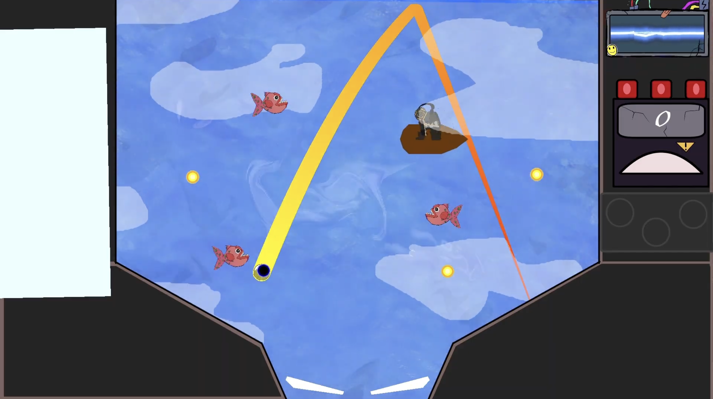
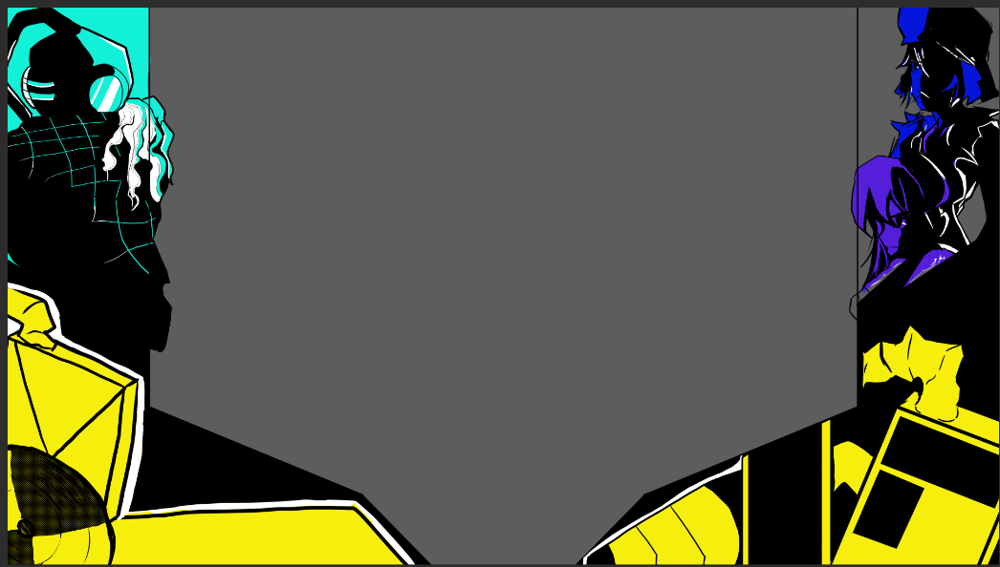
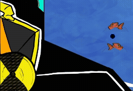
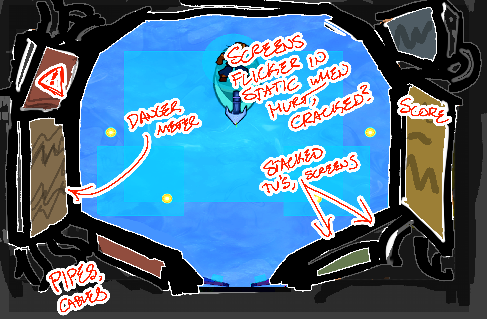
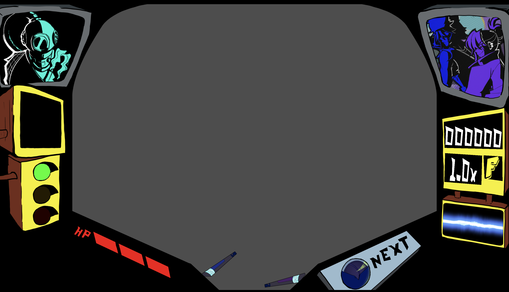
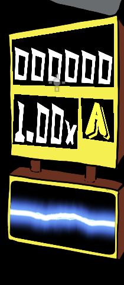
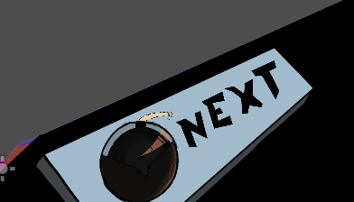

In the Summer of 2025, I worked as the Project Lead and UI/UX Lead for Twinball as part of RIT's Magic Maker Program. While my tasks as Project Lead were vast and My biggest goal over the course of the summer was making our UI easy to read and understandable by anyone playing our game. This is what we started the summer with:

Our big pain points were
- The colors
- lack of clarity
- too much negative space

while some of these could be solved with a proper tutorial, a redesign of the UI could solve a bulk of these issues. I decided to ditch the old colors we have in favor of a Limited Color Palette. This would help the contrast issues as well. So it was time to get to work

## First Pass

After a week or two of back and forth I had come up with this initial sketch. Ditching the colors for a much more striking Yellow and Black, with white as a highlight, taking inspiration from the Persona 5 UI for it's high contrast, readability, and stylishness.

This is the final cleaned up version of that first pass. You can see the Twins on the right and the enemy they're facing (the Diver in this case) on the left. This would cause some issues later on, but for now, it worked the way I wanted it to. I wanted the player to understand that at it's core, Twinball Levels are fights, it's combat. I didn't want to add too many new colors and throw off the vibe of the UI, so they were drawn using only one color and Black and White because of this.

This new UI also accounted for the new Mechanic, the Breakpoint, a special move the Boss can use after a certain amount of time. In this version it's a meter that slowly fills up over time before reaching full capacity and going back to zero. I also tried to make it look like a CD/Disc loading, to make the bar look nicer.

## Second Pass

After our first playtest, we got a lot of feedback. A main issue was still that it was unclear what things were meant to be in the UI. In our attempt to limit the palette to make contrast better, we neglected to make components stand out from each other, resulting in loss of clarity. 

Working with Carrie Stone, another artist on the team, we decided to go for more of a Diagetic UI, making it seem as though the UI were objects the twins themselves scrapped together to make something that would help them in battle.

After that session, this is what we ended up with! Still keeping the High Contrast of the UI, but making components more clear and distinct from each other.

### The Style Meter

Instead of shoving the Style Meter in the corner, it's now on the right side of the screen, showing your current grade, score, and multiplier. We also added on the Special Ability Indicator below it, showing when your special ability is ready to use. Since it's all apart of one component, it helps readability.

### Next Ball

In Twinball, you select 3 balls to bring into battle. Players were having issues with knowing what ball was next and even forgetting entirely what they had picked. We added this component to show the next ball in line. 

### Breakpoint And Phases
The breakpoint is now a flashing meter combined with a traffic light design to indicate what phase the boss is in. Green is phase one, yellow is phase two, and red is phase three. This gives the player a better idea of how far along they are in the fight.

The Breakpoint flashes differently colored warning symbols depending on how close they are to using their breakpoint, during the breakpoint, the symbol switches to a Red Skull indicating danger.

### Characters
The characters are now placed inside CRT-TVs, giving the vibe of us watching them in combat like it's CCTV footage. This also gives us a chance to add some personality to the characters, showing their reactions to the fight as it goes on, which will be implemented later.

## Reception

The reception to the new UI was overwhelmingly positive! Players found the new design to be much more readable and engaging, with many commenting on the high contrast and distinct components. The Diagetic UI elements were particularly praised for adding to the game's charm and personality. I felt much prouder about this version of the UI, and it felt like a big step up from where we were before.