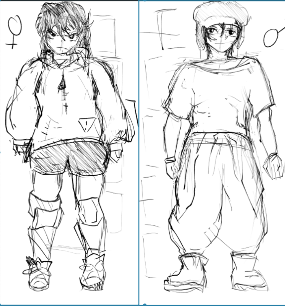

# Twinball
(note! this project is still in progress along with this page!)

## Overview

Currently in development, Twinball is the first game I've made solely for myself. This isn't for class or a game jam, I am developing the game out of my own passion. It is a single player Pinball Boss Rush game. I am developing the game under my game studio, Studio Collider.

## The Design Pillars of Twinball

Twinball presented itself with an interesting challenge when it came to designing it's core mechanics. Pinball is a traditionally vertical game, and video games are a traditionally horizontal medium. Since we were designing it as a boss rush game, that also meant we had two different types of games to pull ideas from. 

After this, I decided to think about a very simple question. What is the worst thing that can happen to the player? I then asked what the worst thing that could happen to the Boss was? What was each person trying to prevent or make happen. Simple! They don't want the ball to hit them, they want it to hit the other. 

From this, we had our Design Pillars. 

### Exploration

Levels will have several different obstacles and components, some of them leading to big rewards if you have the skill to make it. We want players to feel interested in aiming at different objects at a level.

### The Ball Keeps Moving

No matter what, the ball has to keep moving. Everything on the board tries to get the ball to move either in the direction the players want, or the opposite. Even a ball moving AWAY from the boss is a ball that can be redirected.

### Strategy 

The player has different options for balls to use and ways to use them. The types of balls available and the balls that a player chooses to bring into battle will inform their decision on where to aim and what to aim for.

We then based our new mechanics and refined our existing ones to fit this. Every object on a table would now be descended from one of four types, based off what happens when the ball interacts with it.

BUMPERS: when the ball hits this, they ricochet off.

ROLLOVERS: when the balls hits this, they are 'enabled' and the ball passes over it easily.

GRABBERS: when the balls hits this, the ball is frozen before being launch in a certain direction.

LOCKS: when the ball hits this, the ball is taken off the board entirely.

ENVIRONMENT: A catch-all type for different types of hazards and unique special elements to a level that don't necessarily involve the ball. .

## Art Design
Working with the same art lead from Delivery Dan, I drafted up concept sketches and character designs that she would then ideate on and send back to me.

Initial Design for the Two Protagonists

Artist, Maya Teng's, second passthrough

Pre-Alpha concept art, done by me, based off Maya's designs, November 2025

## Acceptance into Magic Maker 2025

After much effort and a rigorous application process, Twinball was accepted into RIT's Magic Maker Program, an incubator program for RIT Students where we'd get real experience working with stakeholders and producers on our project. We got a new artist, Elizabeth (Liz) Doherty, who helped us establish more of that 'Studio Trigger' feel we were going for for the game, and got a composer to help us make music for the game as well.

Lead Character Artist, Liz Doherty, second passthrough of Characters after acceptance into Magic, May 2025

## Redesigning the UI

My other main job aside from being Project Lead was being the UI/UX Lead. My biggest goal over the course of the summer was making our UI easy to read and understandable by anyone playing our game. This is what we started the summer with:

Our big pain points were
- The colors
- lack of clarity
- lack of onboarding

while some of these could be solved with a proper tutorial, a redesign of the UI could solve a bulk of these issues. I decided to ditch the old colors we have in favor of a Limited Color Palette. This would help the contrast issues as well. So it was time to get to work

## First Pass

*Image here*
After a week or two of back and forth I had come up with this initial UI. Ditching the colors for a much more striking Yellow and Black, with white as a highlight.

This new UI also accounted for the new Mechanic, the Breakpoint, a special move the Boss can use after a certain amount of time. In this version it's a meter that slowly fills up over time before reaching full capacity and going back to zero.

*Zoom into image here*

There's also room in this new UI for sprites of the Twins and who they're fighting. I wanted the player to understand that at it's core, Twinball Levels are fights, it's combat. I didn't want to add too many new colors and throw off the vibe of the UI, so they were drawn using only one color and Black and White because of this.

*Images here*

After our first playtest, we got a lot of feedback. A main issue was still that it was unclear what things were meant to be in the UI. In our attempt to limit the palette to make contrast better, we neglected to make components stand out from each other, resulting in loss of clarity. 

Working with Carrie Stone, another artist on the team, we decided to go for more of a Diagetic UI, making it seem as though the UI were objects the twins themselves scrapped together to make something 

## Second Pass

