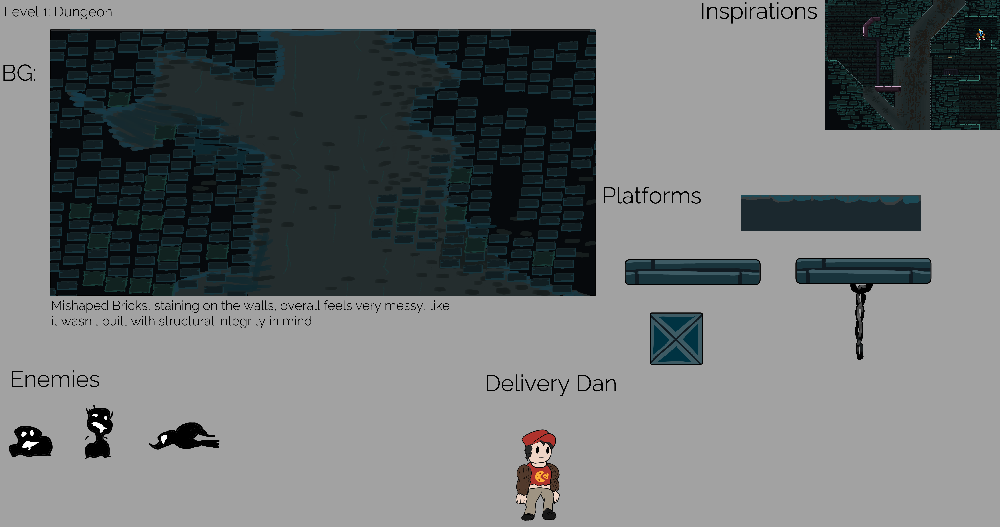
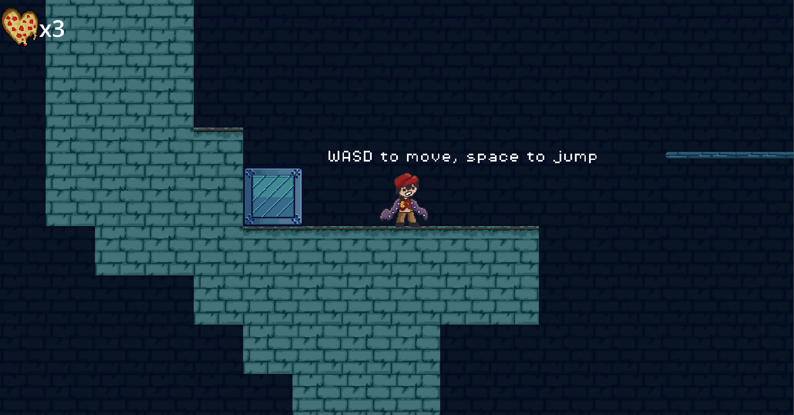

# Delivery Dan



## Overview

After working on [Five Minute Blacksmith](../projects/fiveminblack) for the [Holojam](https://x.com/holofangamejam?lang=en), I realized that I work better with a team. So I built a team of four other people for this project. The theme for the [15th Pirate Jam](https://itch.io/jam/pirate15) was "Shadows" and "Alchemy". 

## Design

After the initial brainstorming session on the first day, we decided to make a platformer that had different powerups/mutations that lasted for a whole level. The game would follow a delivery man who was mutated against his will by a wizard whose delivery order was wrong.

The Art Lead and I then sketched up concept art for each level and the type of monsters that would show up in each world. Originally we had planned for the delivery man to take on a new form every level, but we found out that we were in over our heads. We simplified halfway through the jam to meet the deadline, reducing our scope from 5 levels to 3.

We started to pivot our design halfway through our time when we realized we quite simply did not have enough done.

## Final Submission

We  published to [Itch.io](https://itch.io/jam/pirate15/entries) per the Jam's Rules. The final build includes:

- An opening cutscene, animated by our Art Lead
- One mutation,  which is called “Tentacle Arms”.
- Two levels of gameplay
- A boss fight on the final level

Note - the boss level is very hard to access as it takes a lot of skill to finish the second level.

## What I Learned

I once again learned how to cut back on scope and pivot on plans when they proved to be too difficult. There were many things we wanted for this game that we could not learn how to do in the short time frame, even with the extended team. I also had to coordinate schedules  with different team members  in different time zones. I also learned how to pair program better as there were multiple problems that only were capable of being fixed when multiple people sat in a call to fix it together and communicate properly.

## Images



