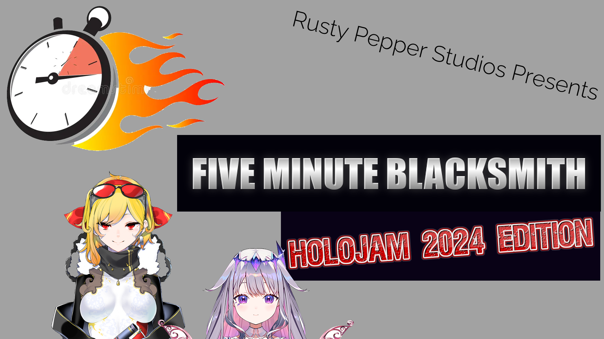
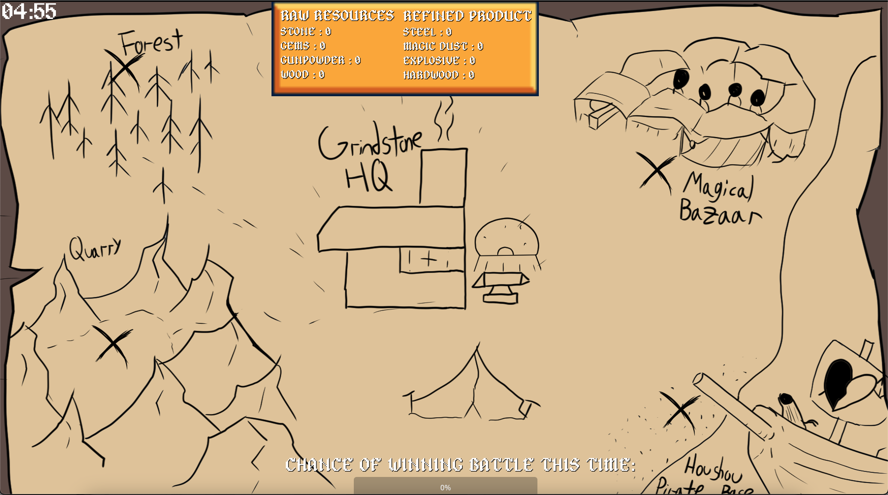



## Overview

This game was developed solo for the [HoloJam 4 Game Jam]() in MENTION WHEN. The game jam was themed around Hololive, the VTuber Agency. As such, the game had to use that IP as a base and then a theme that's specific to each jam. The theme was "Outcome". 

## Initial Design

I did a lot of paper designing before programming since I had a lot of ideas on where to take the game. I wanted it to be a Blacksmith-themed game where you made weapons and collected resources. I picked the two characters from Hololive that best represented this theme: Kaela Kolvalskia and Koseki Bijou. 

My initial sketches included making different types of weapons to change the outcome of a fight in the future. I also wanted to include a top down map for deciding how to collect resources. Unfortunately, I didn't realize how big the scope of this game was about to be and how my skill level could not reach that.

## Final Submission

The final game turned from the initial idea of a skill-based simulation to a clicker game. The time limit/Five Minutes in the title wasn't added until the very last day. 
Gameplay follows you clicking locations on a map to gather Raw Resources. You then click on a grindstone to turn all of your Raw Resources into Refined Resources. You then spend these to make different types of weapons for other characters. Those characters will then act as Auto-Clickers to gather resources automatically. As the title suggests, the game is on a timer and you only have five minutes to do all of these things. The end goal is to change the Outcome of a fight that our characters lost.  

## What I learned From This

This was probably one of the biggest learning experiences I had as a developer and designer. I overscoped, I overworked, and I barely made a functional game. However, I'm still proud that I submitted anything at all. I was able to learn a brand new engine (Godot) and language in a short time frame. I also got really deep with the UI Tools and Controls. This would serve me well in later projects.

## Images



