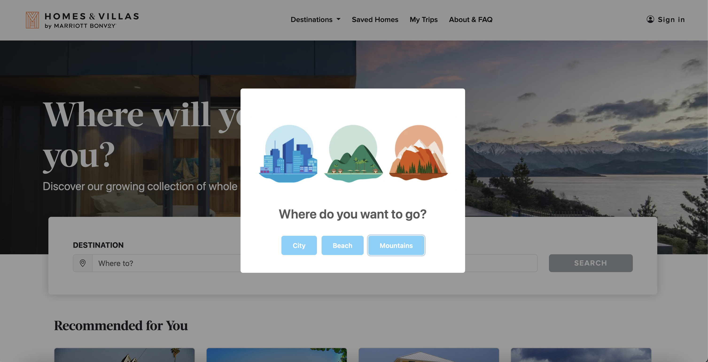

# Hilton Project



## Overview

This project part of the  Global Career Accelerator 2024 Program: Web Development Track. Over the course of the two month program, we learned the principles of Web Design, HTML/CSS, and Javascript. This culminated in a special project developed by the firm Publicis Sapient for Hilton hotels. They wanted us to redesign their current website to simplify the user experience. 

## User Research

Hilton gathered hundreds of surveys and interviews from travelers and hotel customers for us to analyze. These were given in the form of videos and documents. An issue that came up a lot was people not knowing where they wanted to go. The prototype would need to address this complaint.

## Prototype Deliverable

The prototype features an immediate question, prompting the users to think about the location of their trip rather than immediately bombarding the user with information. It then presents the customer a list of locations with the chosen attributes. If you click any of these elements, it also will then take you to an interactive map highlighting that property.

## What Did I Learn From This Project?

This was my first big Web Design project. I got to review user research, write up needs and pain points, and then execute a design that solved the users’ problems. There was a fair amount of code provided by the program runners, but I wrote the  main functions (e.g., making the div elements, sorting by selected location) were all me. 

## Images



