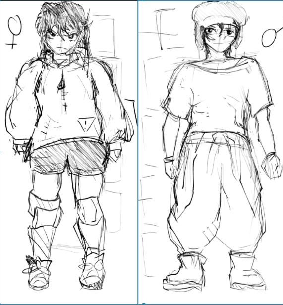
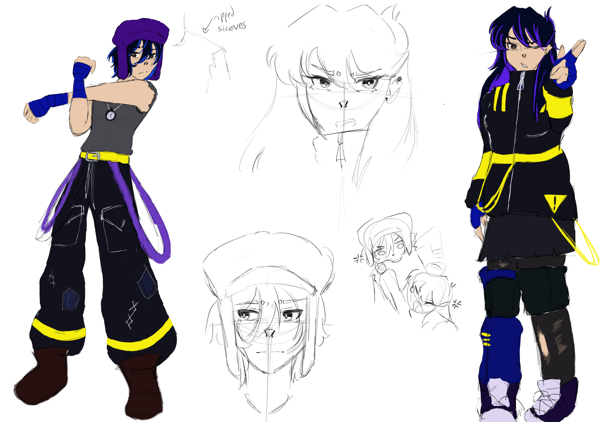

# Twinball
(note! this project is still in progress along with this page!)

## Overview

Currently in development, Twinball is the first game I've made solely for myself. This isn't for class or a game jam, I am developing the game out of my own passion. It is a single player Pinball Boss Rush game. I am developing the game with two close friends.

## Art Design
Working with the same art lead from Delivery Dan, I drafted up concept sketches and character designs that she would then ideate on and send back to me.

Initial Design for the Two Protagonists

Art Lead, Maya Teng's, second passthrough

Pre-Alpha concept art, done by me, based off Maya's designs

## The Design Pillars of Twinball

Twinball presented itself with an interesting challenge when it came to designing it's core mechanics. Pinball is a traditionally vertical game, and video games are a traditionally horizontal medium. Since we were designing it as a boss rush game, that also meant we had two different types of games to pull ideas from. 

After this, I decided to think about a very simple question. What is the worst thing that can happen to the player? I then asked what the worst thing that could happen to the Boss was? What was each person trying to prevent or make happen. Simple! They don't want the ball to hit them, they want it to hit the other. 

From this, we had our Design Pillars. 

### Exploration

Levels will have several different obstacles and components, some of them leading to big rewards if you have the skill to make it. We want players to feel interested in aiming at different objects at a level.

### The Ball Keeps Moving

No matter what, the ball has to keep moving. Everything on the board tries to get the ball to move either in the direction the players want, or the opposite. Even a ball moving AWAY from the boss is a ball that can be redirected.

### Strategy 

The player has different options for balls to use and ways to use them. The types of balls available and the balls that a player chooses to bring into battle will inform their decision on where to aim and what to aim for.

We then based our new mechanics and refined our existing ones to fit this. Every object on a table would now be descended from one of four types, based off what happens when the ball interacts with it.

BUMPERS: when the ball hits this, they ricochet off.
ROLLOVERS: when the balls hits this, they are 'enabled' and the ball passes over it easily.
GRABBERS: when the balls hits this, the ball is frozen before being launch in a certain direction.
LOCKS: when the ball hits this, the ball is taken off the board entirely.
ENVIROMENT: A catch-all type for different types of hazards and unique special elements to a level that don't necessarily involve the ball. .

## Images

