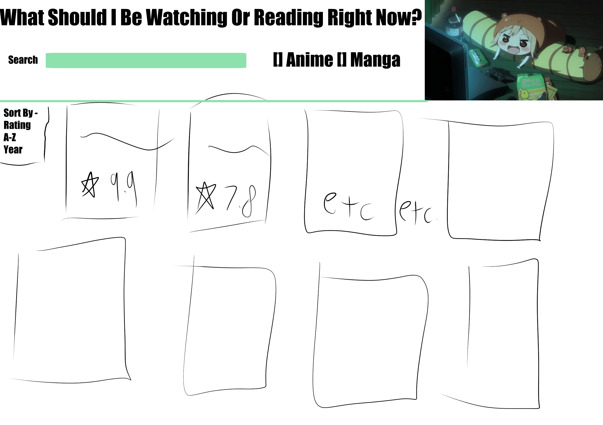

# What Do I Feel Like Watching?



## Overview
For my Fall 2024 Class, Web Technology for Games, we were tasked with designing a website that used a Web API. I picked the Jikan API  to access anime and manga data  (Documentation can be found [here](https://jikan.moe/)). I wanted to build a  website help users find anime and manga  to watch or read next. 

## Design
I knew that I wanted it to be a fairly uncluttered design. I always felt that reading list/watch list websites aren't fun to navigate when there's too much information on screen. So I kept the design to a simple search bar, an option for Anime or Manga, and a dropdown menu for sorting by Rating or Name.

Initial Design

## Technical Architecture

The actual Javascript is under 200 lines of code. 
The script has a fetch data function which grabs a JSON response of anime or manga, then displays a list of Flexbox divs with the image associated with the series, its rating, and the year it was created. Manga on Jikan doesn't have a year value so I had to include an if statement to replace it with the list of volumes instead. 

There are also functions for saving and loading the last search term typed in utilizing Local Storage. 

## Final Product

I am extremely proud of the final product. It’s very fast, there's pagination, and the color scheme keeps the data readable . I think the part of this project I am the most happy with is how useful it is for finding new manga to read or anime to watch.

## What I Learned

I learned how to utilize Javascript to fetch data from a Web API and how to properly use Local Web Storage. This was also the first time I experimented with creating new page and HTML elements through Javascript Functions. I also got to add CSS attributes to make the dynamically created elements responsive to page size.



