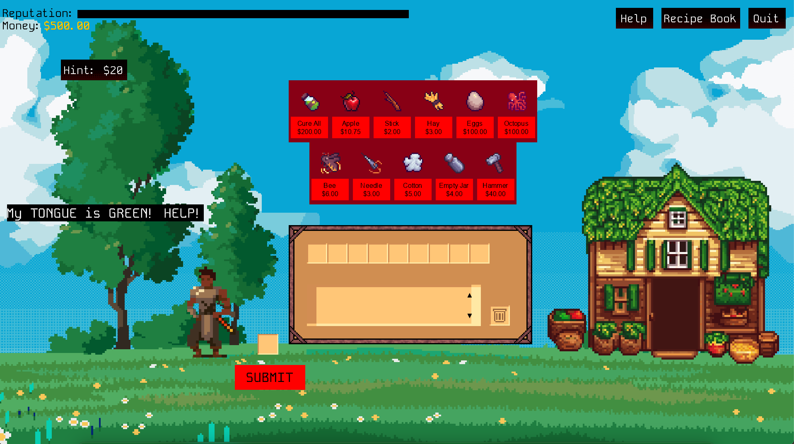
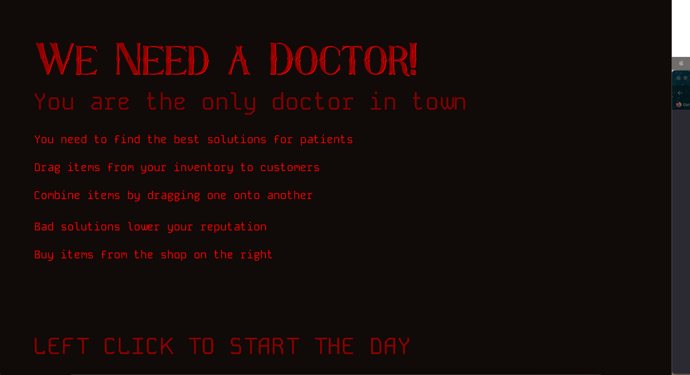

# Malpractice Makes Perfect



## Overview

Developed for my Spring 2024 Problem Solving with Data Structures and Algorithms for Games Class. This project had us work in assigned teams for an entire semester to make a video game in the Monogame Framework.

The game had to utilize File I/O, a clear start-game-end cycle, and use programming principles we had learned over the course of the semester.

## Design

Our team decided to make a game about giving cures to people as a semi-quack doctor. We wanted to include a mix of tongue-in-cheek humor and reward out of the box thinking. 
The game revolves around keeping both your reputation as a trusted doctor and your money both positive. Failure to keep both above 0, and the game ends it's game over.

We decided that using free pixel art assets was the way to go so we could spend more time designing and programming the gameplay.

This proved to be the right move as especially with Monogame as our framework/engine. We had to do everything ourselves with little to no resources online.

## Final Project

Our final project includes one day of business as the owner of the doctor's office. There are four different customers that walk up to you and ask you for help with their illnesses/problems. There are various solutions that work for each patient that have different effects on your overall reputation and cash flow.

## What I Learned

I learned how to work on a project that wasn't immediately due/wasn't being checked on by Professors. I was responsible for the work I did. I also learned how to make Game Design Documents and create solutions to programming problems without any sort of tutorial or resource. This meant a lot of trial and error and learning how to be okay with not knowing everything before starting.

## Images



